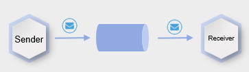
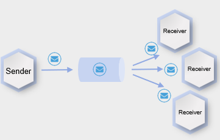
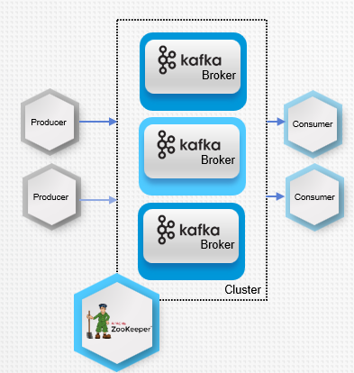
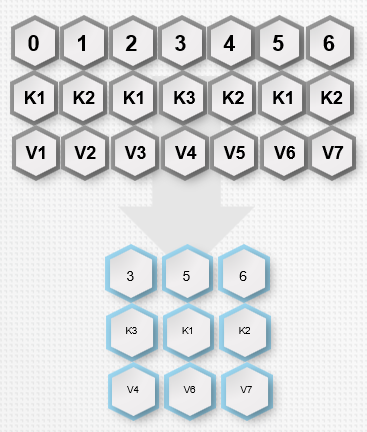
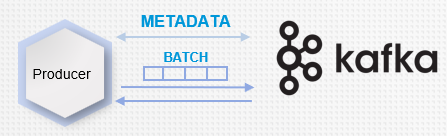
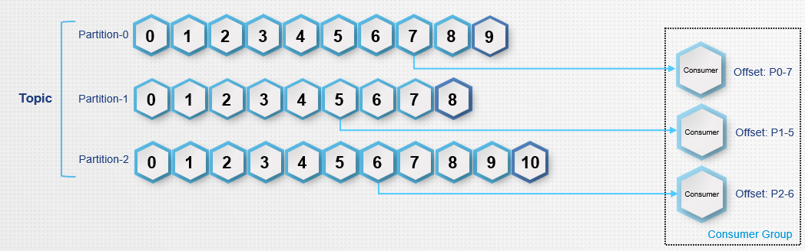
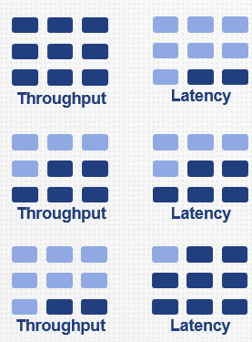
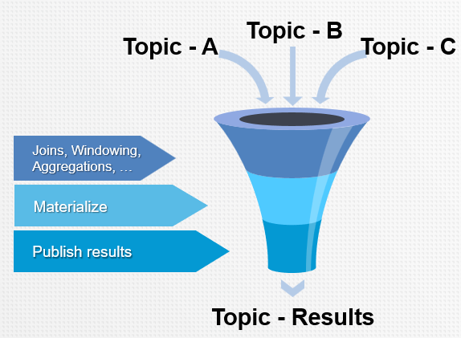
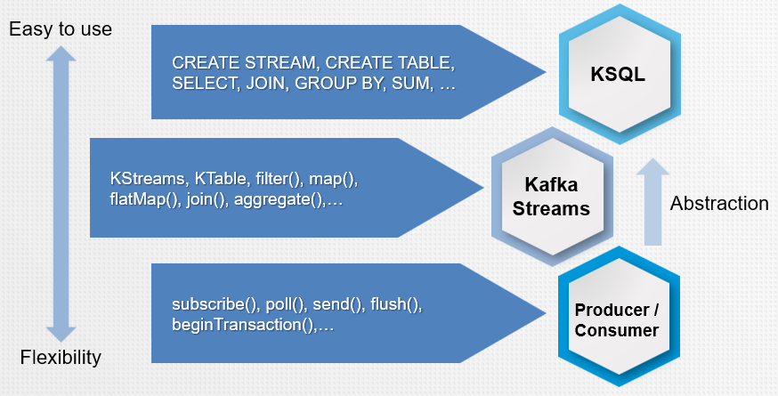
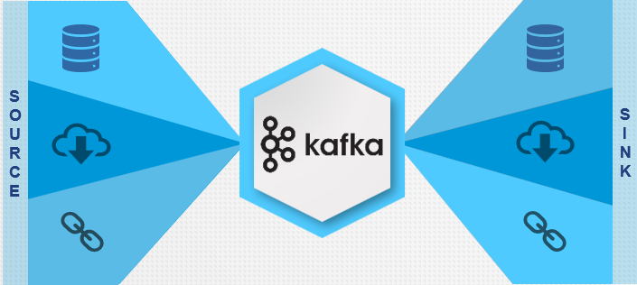

# KAFKA

## Introducción

**Definición:**

> Apache Kafka es una plataforma de streaming distribuido.
> Apache Kafka es una cola de mensajes pub/sub en tiempo real, tolerante a fallos y altamente escalable, diseñada como un registro de transacciones distribuido.

**Componentes:**

*1. Producers:* Permite a una aplicación publicar un flujo de registros en uno o más temas de Kafka.
*2. Consumers:* Permite que una aplicación se suscriba a uno o varios temas y procese el flujo de registros producidos en ellos
*3. Connectors:* Permite crear y ejecutar productores o consumidores reutilizables que conectan temas de Kafka a aplicaciones o sistemas de datos existentes.
*4. Streams:* Permite que una aplicación actúe como un procesador de flujos, consumiendo un flujo de entrada de uno o más temas y produciendo un flujo de salida hacia uno o más temas de salida, transformando efectivamente los flujos de entrada en flujos de salida.

**Sistemas de Mensajería:**

- *Point to Point Messaging System*
En un sistema punto a punto, los mensajes se almacenan en una cola. Uno o varios consumidores pueden consumir los mensajes de la cola, pero un mensaje concreto sólo puede ser consumido por un consumidor como máximo. 
Una vez que un consumidor lee un mensaje de la cola, éste desaparece de la misma.

- *Publish-Subscribe Messaging System:*
En el sistema de publicación-suscripción, los mensajes se almacenan en un tema. A diferencia del sistema punto a punto, los consumidores pueden suscribirse a uno o varios temas y consumir todos los mensajes de ese tema. En el sistema Publish-Subscribe, los productores de mensajes se denominan editores y los consumidores de mensajes, suscriptores. 

## Arquitectura

En la arquitectura de Kafka debemos saber que existen dos componentes principales que son esenciales para que funcione Kafka.

**Brokers:**

- Operar como parte de un clúster.
- Particiones y réplicas de temas de almacenamiento
- Los datos escritos en Kafka se escriben en disco y se replican para la tolerancia a fallos
- Recibe mensajes de los productores. 
- Les asigna offsets 	
- Consigna los mensajes al almacenamiento en disco.
- Sirve a los consumidores
- Responde a las solicitudes de obtención de particiones 
- Responde con los mensajes.

**Zookeeper:**

- Realiza un seguimiento del estado de los nodos del clúster Kafka
- Pertenencia al clúster
- Elección del controlador
- Configuración de temas
- Listas de control de acceso

## Topics

- Un flujo de mensajes pertenecientes a una categoría determinada se denomina tema.
- Un tema Kafka se divide en particiones. 
- Cada partición es una secuencia totalmente ordenada de mensajes con un ID único denominado offset.
- **Líder.** Cada partición tiene un servidor que actúa como líder.

## Replicas

- Las réplicas se reparten entre los corredores disponibles.
- Copias de seguridad de una partición.
- Se utilizan para evitar la pérdida de datos.
- No sirve peticiones de clientes; sólo mantenerse al día con el líder.
- Consume mensajes del líder como lo haría un consumidor normal de Kafka. 
- ISR (réplicas en sincronía) cuando no están demasiado lejos; cuán lejos es demasiado lejos es configurable.
- Si la réplica líder falla, una de las ISR será promovida a líder.

## Record Retention

Los registros publicados (consumidos o no) se conservan durante un periodo configurable.

Los registros están disponibles para su consumo hasta que se descartan por:
  - Tiempo: Periodo de retención configurable
  - Tamaño: Retención configurable basada en el tamaño de la partición
  - Compactación: Mantiene el último registro para cada clave

## Log Compaction

Los temas compactados proporcionan un tipo de flujo muy diferente, manteniendo sólo el mensaje más reciente de una clave dada.
- Kafka hace un amplio uso de ellos internamente 
- Aplicaciones de usuario: útiles para datos de tipo registro de cambios, en los que sólo interesa la última actualización

La compactación de registros se ejecuta periódicamente en segundo plano
- La compactación permite borrar registros con clave y valor nulo.

Todos los desplazamientos siguen siendo válidos, incluso si el registro del desplazamiento se ha compactado.

## Producers

*Definición:*

> Un productor Kafka es una aplicación que puede actuar como fuente de datos en un clúster Kafka.
Un productor puede publicar mensajes en uno o más temas de Kafka.

**Métodos de envío existentes:**
- *Fire-and-forget:* No esperar ACK - muy alto rendimiento - acks = 0
- *Asíncrono:* espera al ACK del líder - acks = 1
- *Sincrónico:* Esperar al ACK del Líder + Réplicas - Seguro - acks = todos

Los productores de Kafka intentan agrupar los mensajes enviados en lotes para mejorar el rendimiento.

**Asignación de particiones:**

- Round-robin
- Función de partición basada en la clave

## Consumers

- Las particiones se asignan a los Consumidores dentro del Grupo de Consumidores-
- Los consumidores recuerdan las particiones donde las dejaron. - comprometerse con Kafka.
- Mover la propiedad de una partición de un consumidor a otro se denomina reequilibrio. Ventana corta de indisponibilidad de todo el grupo de consumidores.

## Delivery Semantics

**Como máximo una vez** 
- Un mensaje debe entregarse como máximo una sola vez. Es aceptable perder un mensaje en lugar de entregarlo dos veces en esta semántica.  

**Al menos una vez**
- Es aceptable entregar un mensaje más de una vez, pero no debe perderse ningún mensaje. El productor se asegura de que todos los mensajes se entregan con seguridad, aunque pueda dar lugar a la duplicación de mensajes. 

**Exactamente una vez**
- Un mensaje debe entregarse una sola vez y no debe perderse ningún mensaje. Esta es la semántica de entrega más difícil de todas.
- 

# Kafka Streams

*Definición:* 

> Un flujo es la abstracción más importante proporcionada por Kafka Streams, este representa un conjunto de datos ilimitado y en continua actualización.
Una partición de flujo es una secuencia ordenada, reproducible y tolerante a fallos de registros de datos inmutables, donde un registro de datos se define como un par clave-valor.
Cualquier programa que utilice la biblioteca Kafka Streams. Puede definir su lógica computacional a través de una o más topologías de procesador.

**DSL de flujos de Kafka:**
Una API de alto nivel que proporciona las operaciones de transformación de datos más comunes, como map, filter, join y aggregations.

**API de procesadores:**
Una API de bajo nivel que permite añadir y conectar procesadores, así como interactuar directamente con los almacenes de estado.

## State Management

- **Procesamiento de un solo evento:** *no requiere estado*
  - Lo que significa que el procesamiento de un mensaje es independiente del procesamiento de todos los demás mensajes

- **Procesamiento con estado local**
  - La mayoría de las aplicaciones de procesamiento de flujos se ocupan de la agregación de información, especialmente la agregación de ventana de tiempo  KTable
  - Internamente, Kafka Streams proporciona un almacén de estado tolerante a fallos que utiliza tanto un tema de registro de cambios creado y compactado internamente como una instancia incrustada de RocksDB

- **Procesamiento multifase**
  - Enfoque en dos fases
  - Escribir resultados intermedios en un nuevo tema con una única partición
  - Lectura del tema intermedio con una única instancia de consumidor

# KSQL

**Características:**

- *KSQL engine* - procesa sentencias y consultas KSQL
- *REST interface*  - permite el acceso del cliente al motor
- *KSQL CLI* - consola que proporciona una interfaz de línea de comandos (CLI) al motor
- *KSQL UI* - permite desarrollar aplicaciones KSQL en Confluent Control Center

# Schema Registry

**¿Por qué?**

Avro requiere que todo el esquema esté presente al leer el registro, por lo que el esquema debe estar ubicado en algún lugar.

**¿Cómo?**

- Almacena todos los esquemas utilizados para escribir datos en Kafka en el registro.
- Al utilizar KafkaAvro(De)Serializer, el esquema se almacena automáticamente y se extrae cuando es necesario.

**Beneficios**

- Afrontar los retos organizativos de la gestión de datos
- Canalizaciones de datos resistentes
- Evolución segura de esquemas
- Eficiencia de almacenamiento y cálculo
- Descubrimiento de datos
- Ecosistema rentable
- Aplicación de políticas de datos

# Kafka Connect

**Proporciona**
- Framework para integrar fácilmente Kafka con otros sistemas
- Biblioteca de componentes reutilizables
  - Conectores de origen
  - Conectores Sink

**Características**
- Escalabilidad
- Tolerancia a fallos
- Gestión centralizada
  - API REST
- Propagación de esquemas

Kafka Connect se ejecuta como un clúster de procesos worker.
Instala Apache Kafka en todas las máquinas y simplemente inicia los brokers en algunos servidores e inicia connect en otros.

