## NoSQL

### *Introducción*

Las bases de datos NoSQL están diseñadas específicamente para modelos de datos específicos y tienen esquemas flexibles para crear aplicaciones modernas. Las bases de datos NoSQL son ampliamente reconocidas porque son fáciles de desarrollar, por su funcionalidad y el rendimiento a escala.

Las bases de datos NoSQL utilizan una variedad de modelos de datos para acceder y administrar datos. Estos tipos de bases de datos están optimizados específicamente para aplicaciones que requieren grandes volúmenes de datos, baja latencia y modelos de datos flexibles, lo que se logra mediante la flexibilización de algunas de las restricciones de coherencia de datos en otras bases de datos.

### *Almacenamiento de Datos*

La importancia de la arquitectura Big Data tiene al fin y al cabo un gran impacto en diferentes aspectos, tales como:

1. Ingesta
2. Volumen
3. Accesibilidad

Además, podemos encontrar que con las bases de datos no relacionales podemos almacenar diferentes tipos de datos:

- Archivos
- Clave-Valor
- Documentos
- Gráficos
- En memoria
- Indexados

## Almacenamiento de Archivos

Descripción:

> El almacenamiento de archivos es un sistema distribuido, tolerante a fallos y normalmente compatible con POSIX. Este escompatible con POSIX. Se comporta de forma similar a un sistema de archivos normal y puede almacenar grandes conjuntos de datos, que se dividen en bloques y se replican. 

**Apectos clave:**

- Forma simple y barata de almacenamiento
- Lectura secuencial
- Múltiples formas de almacenamiento
   - Texto o Binario
   - Estrucurado (AVRO) o desestructurado (Imágenes)
   - Orientado a columnas

*Tecnologías:*

*Formatos de alamcenamiento de archivos:*

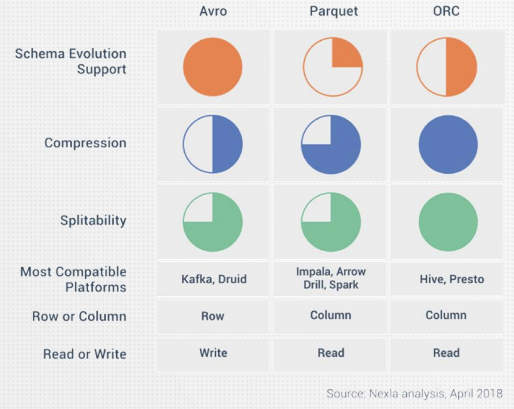

## Clave - Valor

Descripción:

> Key-Value Store (o bases de datos orientadas a columnas) es un paradigma de almacenamiento de datos diseñado para almacenar, recuperar y gestionar matrices asociativas, una estructura de datos hoy más conocida como diccionario o tabla hash.

*Tecnologías:*

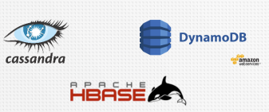

**Apectos clave:**

- Adecuado para
   - Patrones de acceso muy bien definidos
   - Acceso aleatorio de lectura o escritura
- Se adapta muy bien
- Columnas dinámicas
- Esquema en lectura

## Almacen de documentos

Descripción:

> Un Almacén de Documentos (o base de datos orientada a documentos), o, es un programa informático diseñado para almacenar, recuperar y gestionar información orientada a documentos, también conocida como datos semiestructurados (por ejemplo, JSON o XML).

**Apectos clave:**

- Lenguaje de consulta propio
- Facilidad para almacenar y recuperar documentos
- API REST (para almacenes JSON)

*Tecnologías:*

## Gráficos

Descripción: 

> Una base de datos gráfica es una base de datos que utiliza estructuras gráficas para consultas semánticas con nodos, aristas y propiedades para representar y almacenar datos.

**Apectos clave:**

- Bueno para representar relaciones (redes)
   - Lenguaje de consulta propio
   - Rendimiento
   - Presentación
- No es escalable 

*Tecnologías:*

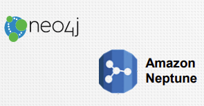

## Base de Datos en memoria

Descripción:

> Una base de datos en memoria (IMDB, también sistema de base de datos en memoria principal o MMDB o base de datos residente en memoria) es un sistema de gestión de bases de datos que se basa principalmente en la memoria principal para el almacenamiento de datos informáticos. Se contrapone a los sistemas de gestión de bases de datos que utilizan un mecanismo de almacenamiento en disco.

**Apectos clave:**

- Gran rendimiento
- Difícil de gestionar
  - Estado de los datos
  - Distribución (escalabilidad)
- Adecuado como
  - Caché
  - Almacén de datos para aplicaciones de streaming

*Tecnologías:*

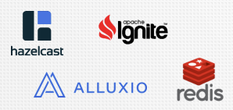

## Datos Indexados

Descripción:

> Una base de datos indexada puede considerarse un subtipo de almacén de documentos, que proporciona un motor de búsqueda de texto completo distribuido y multiusuario con una interfaz web HTTP y documentos JSON sin esquema.

**Apectos clave:**

- Comparte muchas características de los almacenes de documentos (QL propio, almacenamiento de documentos, API REST)
- Funciones de búsqueda de texto como
  - Faceting
  - Búsqueda de texto libre
  - Sinónimos
  - Autocompletar

*Tecnologías:*

## Teorema CAP

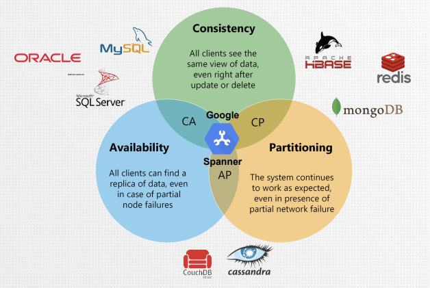

El Teorema CAP nos sugiere que todo sistema distribuido de almacenamiento de datos es vulnerable a fallos de conectividad de la red, por lo que, frente al nivel de tolerancia de la partición de los nodos, tendrá que realizar algún tipo de concesión entre el acceso a la información o a su versión más reciente.

Este teorema fue presentado por Eric Brewer en el año 2000 y su nombre está basado en los siguientes tres atributos claves de los sistemas distribuidos:

- **C - Consistencia (Consistency):** Se refiere a la lectura coherente del valor actual del dato desde cualquier instancia, es decir que los datos se encuentran sincronizados y replicados en todos los nodos a la vez.

- **A - Disponibilidad (Availability):** Se refiere a obtener una respuesta válida y rápida para todas las solicitudes, aunque existan nodos inactivos, es decir el acceso a los datos sin interrupciones.

- **P - Tolerancia a particiones (Partition tolerance):** Se refiere a la capacidad del sistema para permanecer estable y continuar procesando solicitudes a pesar de ocurrir una partición (interrupción) entre la comunicación de los nodos.

# Cassandra

*Definición:*

> Apache Cassandra es un sistema de gestión de bases de datos NOSQL distribuido, de código abierto y gratuito, con un amplio almacén de columnas, diseñado para manejar grandes cantidades de datos en muchos servidores básicos, proporcionando alta disponibilidad sin un único punto de fallo.
>
> Cassandra ofrece un sólido soporte para clústeres que abarcan múltiples centros de datos, con replicación asíncrona sin maestro que permite operaciones de baja latencia para todos los clientes.

### Características

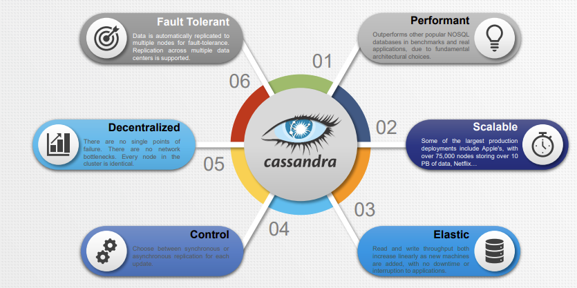

### Cuándo usar Cassandra

La aplicación Cassandra ideal tiene las siguientes características:
- Las escrituras superan a las lecturas por un amplio margen.
- Los datos se actualizan raramente y cuando se realizan actualizaciones son idempotentes.
- El acceso de lectura se realiza mediante una clave primaria conocida.
- Los datos se pueden particionar mediante una clave que permite repartir la base de datos uniformemente.
a través de múltiples nodos.
- No son necesarias las uniones ni los agregados.

### Casos de uso

Algunos casos de uso para Cassandra serían:
- Registro de transacciones: Compras, puntuaciones de exámenes, películas vistas y última ubicación del usuario.
- Almacenamiento de datos de series temporales (siempre que hagas tus propios agregados)
- Seguimiento de prácticamente cualquier cosa, incluido el estado del pedido, paquetes, etc.
- Almacenamiento de datos de seguimiento de la salud.
- Historial del servicio meteorológico.
- Estado del Internet de las cosas (IoT) e historial de eventos.

### Conceptos básicos

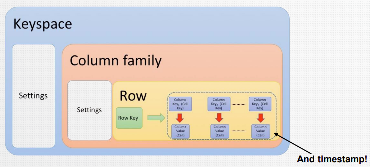

### Primary Keys

Los conceptos de clave en Cassandra son diferentes a las bases de datos Relacionales.
- Clave primaria: Es lo que se llama una clave de partición. A parte de la unicidad del registro en la base de datos, determina la localidad de los datos o en qué nodo deben almacenarse.
- Clave primaria compuesta: Una clave primaria compuesta está formada por una o más columnas a las que se hace referencia en la clave primaria. Se forma así:
  - *((Partition_Key_1,...Partition_Key_N), (Cluster_Key_1,...Cluster_Key_N))*
  - Clave de partición: El propósito de una clave de partición es identificar la partición o nodo del cluster que almacena esa fila.
  - Clave de clusterización: El propósito de la clave de agrupación es almacenar los datos de la fila en un ordenados.

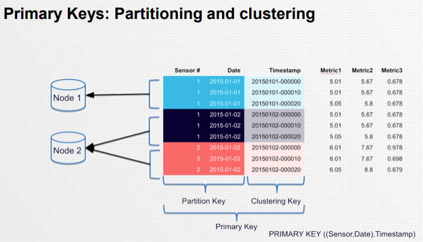

### Querys Lenguaje de Cassandra (CQL)

- CQL (Cassandra Query Language) ofrece un modelo cercano a SQL en el sentido de que los datos se ponen en tablas que contienen filas de columnas. Por esa razón, cuando se utilizan en esta formación, estos términos (tablas, filas y columnas) tienen la misma definición que en SQL.
- No se refieren al concepto de filas y columnas que se encuentra en la obsoleta API thrift (y versiones anteriores 1 y 2 de CQL).

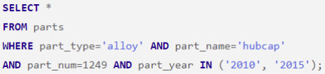

### Commands

Dentro del lenguaje de Cassandra podemos encontrar una serie de datos que podrían llegar a resultar interesantes conocer, a continuación a parecerán una serie de imágenes donde podemos observar diferentes querys y comando para ejecutar acciones en Cassandra:

**Data Definition:**

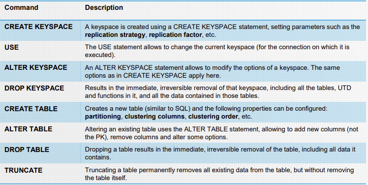

**Data Manipulation:**

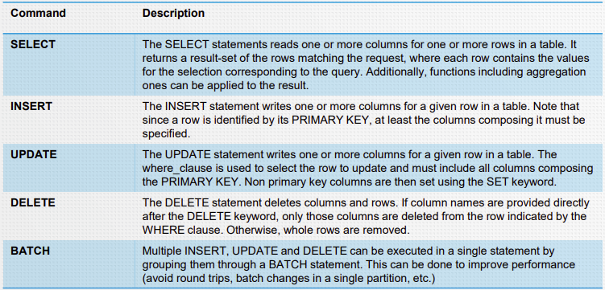

