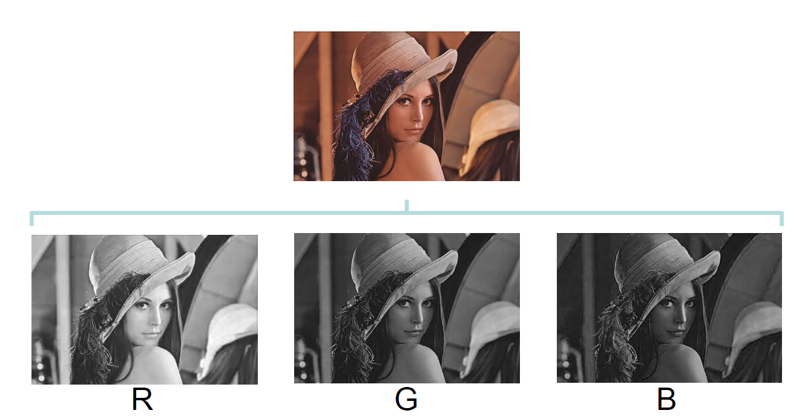

# Visión Artificial

- Clasificación
- Detección
- Segmentación: clasifica las imagenes por pixeles, ya que clasifica parte de las imagenes en funcion de lo que sea cada cosa, pixel por pixel

## Imagen Digital

Con las imagenes artifciales tenemos matrices bidimensionales de pixeles y cada pixel tiene un valor concreto asociado dependiendo de la intensidad lumínica que se quiera representar.

La intensidad de los píxeles se representa en dos rangos bien definidos:
- [0, 255] si la información se codifica como números enteros sin signo de 8 bits .
- [0.0, 1.0] si la información se representa en número en como flotante de 32 bits.

Los colores se representan en imagen digital como la combinación de
intensidad de los canales R (red), G (green), B (blue).

Por otro lado, podemos ver como el histograma de una imagen nos permite evaluar la frecuencia de aparición de cada uno de los distintos niveles de intensidad.

La ecualización de histograma permite mejorar el contraste de las imágenes.
- Para ello utiliza la distribución acumulada de probabilidad como función de transferencia.
- Se utiliza información global de la imagen.
- El resultado es un histograma más distribuido entre los distintos niveles de gris.

## **VIP**

**Una convolucion es un filtro que nos permite cambiar una imagen**

**Un filtro es una matriz pequeña (3x3, 5x5, 7x7...) que define como se va a modificar la imagen**

Se aplican multiplicaciones y sumas de la vecindad de cada píxel de la imagen de entrada con el filtro para calcular los valores de la imagen de salida.

- Al aplicar una convolución la imagen de salida es más pequeña que la imagen de entrada.
- Para solventar esto se utiliza el padding.
- Existen diversos tipos de padding, pero el más común es rellenar con ceros.

## Herramientas

- El filtro gaussiano es una forma más robusta de eliminar altas frecuencias, a cambio de un mayor coste computacional.
- Los valores del filtro se definen a partir del tamaño de la matriz y de la desviación típica de la distribución gaussiana.

Las zonas de alta intesidad son aquellas en las que hay un cambio brusco entre los pixeles y los pixeles adyacentes, como por ejemplo una zona de sol y sombra, ya que la intensidad de los pixeles varia en gran medida y por eso se les lleama zonas de alta intensidad tal y como podemos ver a continuación:

Se ponen los valores a 0 en segmentacion cuando las zonas no corresponden a la imagen que quiero analizar y a 1 al contorno y al interior de la imagen que queremos segmentar.

Algunos de los parámetros que se pueden obtener mediante las máscaras de segmentación son:

- Área
- Relación de aspecto
- Diámetro de contorno
- Bounding Box
- Orientación

## Fundamentos

Los bloques convolucionales son los encargados de extraer patrones
bidimensionales de las imágenes.

Los principales parámetros a configurar en los bloques convolucionales son:
- Número de filtros.
- Tamaño de filtros.
- Padding.
- Stride.
- Activation.

A esto se debe añadir que en cada se van a aplicar diferentes flitros para poder realizar la tarea de clasificación, segmentación, etc. 

### BLOQUES CNN

**Tamaño**

- La salida de los bloques convolucionales se denomina mapas de activación.
- El tamaño de la última dimensión de los mapas de activación depende del número de filtros del bloque.

**Filtros**

- El tamaño de los filtros del bloque define cuantas files y columnas van a tener los filtros que componen el bloque.

**Padding**
- El padding va a definir si se añaden píxeles en los bordes de los mapas de activación para mantener el número de filas y columnas realizar la convolución.
- El número de píxeles a añadir depende del tamaño de los filtros.

Si el stride es de 1 el tamaño de la imagen de entrada y de salida será la misma, pero si el stride es de 2, el tamaño de la imagen de salida será el doble del de la entrada.

**Pooling**

Nos interesa que el tamaño de la imagen se vaya reduciendo a lo largo de la red neuronal, mediante los **bloques de pooling**.

- Los tipos de pooling más habituales son el MaxPooling y el AveragePooling.
- Generalmente, se configura los bloques de Pooling con tamaño 2x2 y stride 2 para reducir el tamaño de los mapas de activación a la mitad.

**Flatten**

El bloque flatten se utilizan para convertir los mapas de activación a un vector unidimensional que pueda ser procesado por bloques fully-connected.

**Fully Connected**

Los bloques fully connected son los que componen las redes neuronales
tradicionales.

Generalmente se utilizan como bloques finales en las CNN.

Los principales parámetros a configurar en los bloques convolucionales son:

- Número de neuronas.
- Función de activación.

